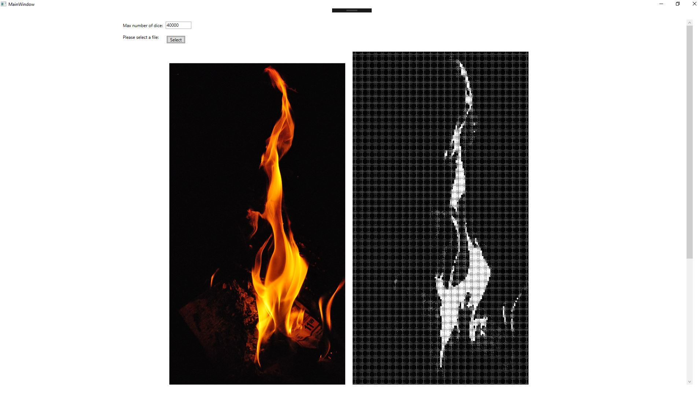
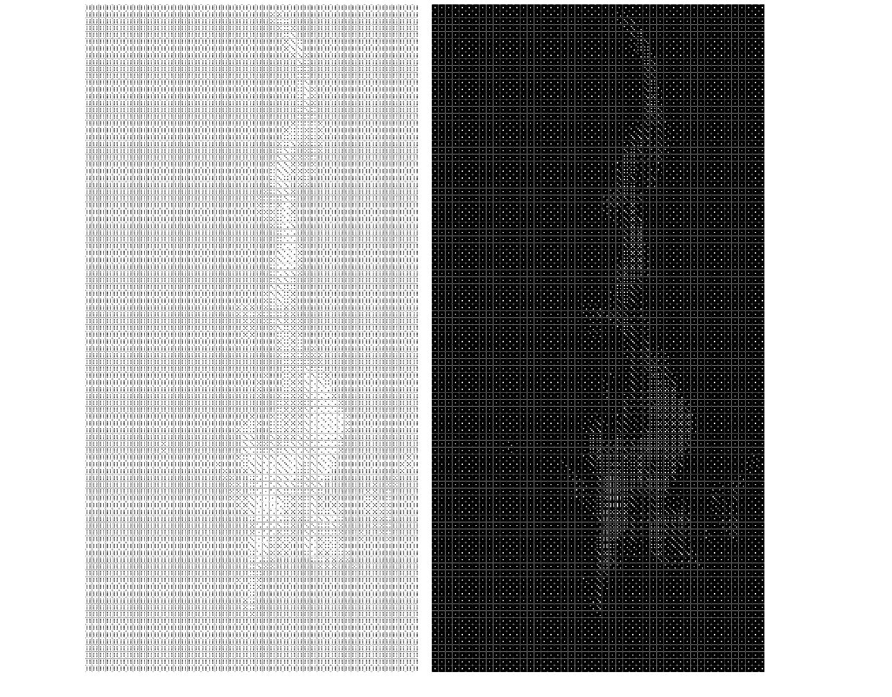
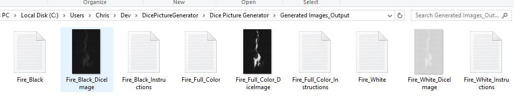
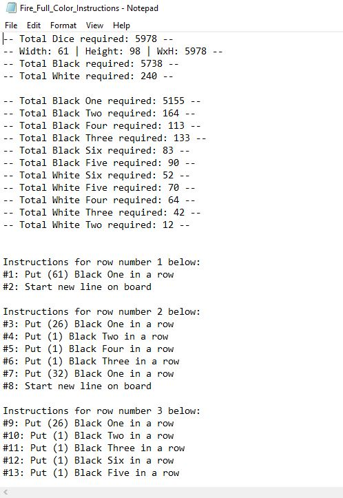

# Dice-Picture-Converter

Inspired by this post on Reddit:
https://www.reddit.com/r/DIY/comments/a411hu/i_made_a_portrait_of_a_friend_out_of_13000_dice/

This project is a Picture to Dice converter for any given image, with the benefit of being able to output multiple variations of dice packs.
By default, the project will output the picture converted with the following dice packs: Black, White, Black and White.
Adding more packs of dice and colors would be incredibly easy, and I am willing to accept pull requests 

In addition, it will also output instructions for all created images if you want to actually assemble the dice yourself.

Using this project, I was able to create this picture as an anniversary gift.

